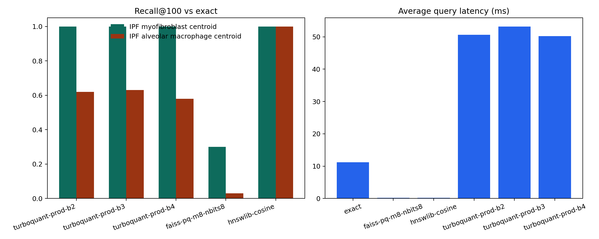

Real-data case study
====================

This article connects the public SCimilarity tutorial dataset to the TurboCell Atlas benchmark pipeline and shows the complete input-to-output story.

What this case study contains
-----------------------------

The case study includes:

* the input data description
* query definitions
* pipeline-stage summaries
* candidate-versus-rerank comparisons
* benchmark summaries
* interpretation and limitations

Why this page matters
---------------------

The case-study page is where method discussion becomes concrete. It shows not only whether a scenario worked, but what data were used, how the query was constructed, what artifacts were generated, and how the result should be interpreted.

Key result
----------

The most favorable current result remains the ``IPF myofibroblast centroid`` scenario, where TurboQuant preserved the exact top-100 neighborhood while reducing candidate-layer memory substantially.

Figure
------

