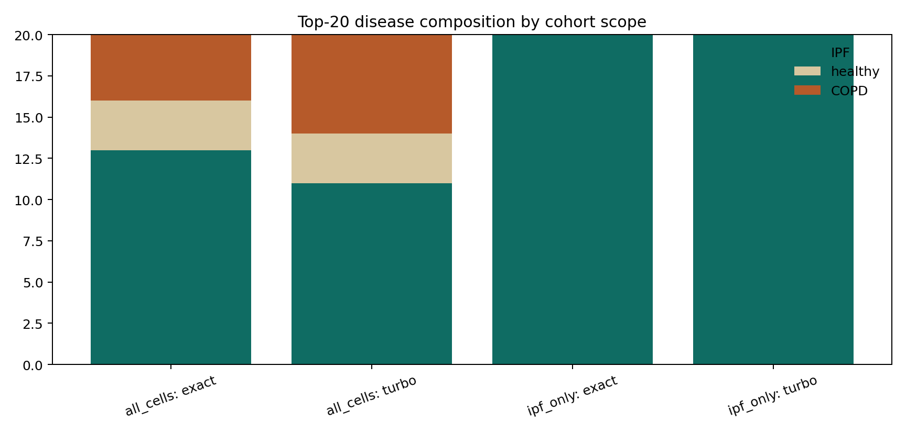

# Tutorial Article: Cohort Triage with Metadata Filters

This article reports an executed cohort-triage analysis on the public SCimilarity tutorial dataset. The scenario uses the `IPF alveolar macrophage centroid` and compares whole-atlas retrieval with disease-restricted retrieval.

## Question

What changes when the same query is searched against the full atlas versus an `IPF`-only cohort?

## Data and query

- dataset: `GSE136831_subsample.h5ad`
- embedding space: official SCimilarity encoder
- query: centroid of all `IPF alveolar macrophage` embeddings
- source cells used for the centroid: `4,389`

## Result figure

## Result table

The executed summary is written to `artifacts/scenario_articles/cohort_triage_summary.csv`.

| Scope | Method | Active cells | Avg latency (ms) | Top-20 alveolar macrophage fraction | Top-20 IPF fraction | Top-20 overlap vs exact |
| --- | --- | ---: | ---: | ---: | ---: | ---: |
| `all_cells` | `exact` | `50,000` | `12.34` | `0.95` | `0.65` | `1.00` |
| `all_cells` | `turboquant-prod-b3` | `50,000` | `57.42` | `0.95` | `0.55` | `0.10` |
| `ipf_only` | `exact` | `23,803` | `8.97` | `1.00` | `1.00` | `1.00` |
| `ipf_only` | `turboquant-prod-b3` | `23,803` | `29.37` | `0.90` | `1.00` | `0.30` |

The top-20 disease composition is written to `artifacts/scenario_articles/cohort_triage_disease_composition.csv`:

- `all_cells: exact` -> `13` IPF, `3` healthy, `4` COPD
- `all_cells: turbo` -> `11` IPF, `3` healthy, `6` COPD
- `ipf_only: exact` -> `20` IPF
- `ipf_only: turbo` -> `20` IPF

## Interpretation

This scenario shows why metadata filters are part of the retrieval model, not a cosmetic option.

- Without filtering, even an `IPF`-derived query retrieves a mixed disease neighborhood.
- Restricting the cohort to `IPF` changes the biological story completely: the top-20 becomes entirely disease-consistent.
- The filtered TurboQuant run is still not exact-faithful, but it becomes more interpretable because the active cohort is biologically aligned with the question.

The key lesson is that atlas retrieval should often be framed as cohort triage first and ranking second.

## Output artifacts

- `artifacts/scenario_articles/cohort_triage_summary.csv`
- `artifacts/scenario_articles/cohort_triage_disease_composition.csv`
- `artifacts/scenario_articles/cohort_triage_thumbnail.png`
- `docs/assets/scenario-cohort-triage.png`
