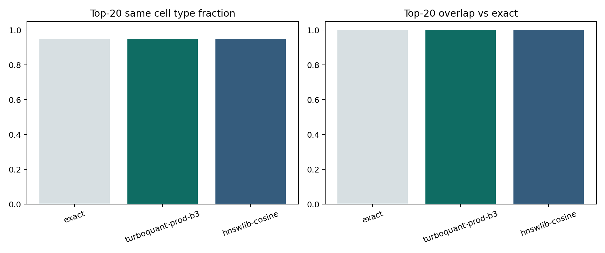

# Tutorial Article: Single-Cell Query

This article reports an executed single-cell query analysis on the public SCimilarity tutorial dataset. Instead of using a centroid, it uses one `IPF myofibroblast cell` as the query.

## Question

If I start from one real cell instead of a centroid, do I still retrieve the expected neighborhood?

## Result figure

## Result table

The executed summary is written to `artifacts/scenario_articles/single_cell_query_summary.csv`.

| Method | Query sample | Top-20 same cell type fraction | Top-20 IPF fraction | Top-20 overlap vs exact | Recall@100 vs exact | Avg latency (ms) |
| --- | --- | ---: | ---: | ---: | ---: | ---: |
| `exact` | `DS000011735-GSM4058962` | `0.95` | `0.95` | `1.00` | `1.00` | `10.40` |
| `turboquant-prod-b3` | `DS000011735-GSM4058962` | `0.95` | `0.95` | `1.00` | `1.00` | `45.39` |
| `hnswlib-cosine` | `DS000011735-GSM4058962` | `0.95` | `0.95` | `1.00` | `1.00` | `0.11` |

## Interpretation

This is useful for wet-lab workflows because many users begin with one interesting cell, not a carefully curated centroid.

- the local neighborhood remained biologically coherent
- TurboQuant matched exact perfectly for this single-cell example
- this suggests that some practical searches can start from one representative cell before moving to centroid-based refinement

## Output artifacts

- `artifacts/scenario_articles/single_cell_query_summary.csv`
- `artifacts/scenario_articles/single_cell_thumbnail.png`
- `docs/assets/scenario-single-cell.png`
