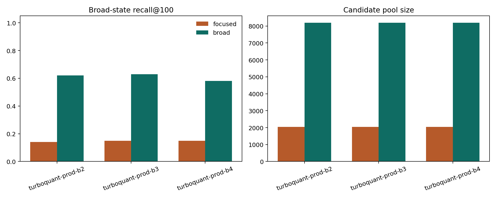

Broad-state tuning
==================

Why this scenario matters
-------------------------

Broad and heterogeneous cell states are harder for compressed candidate generation than compact rare states. This scenario is important because it shows where the method still struggles.

Objective
---------

The tutorial asks how recall changes when query planning is made broader and more adaptive for a diffuse state such as an ``IPF alveolar macrophage centroid``.

What it teaches
---------------

This article is useful because it is honest about the current limits of the package. The broad-state scenario demonstrates that query planning matters, and that the strongest setting for one scenario will not automatically transfer to another.

How to read the result
----------------------

When reading this tutorial, do not focus only on whether the broad setting is better. Also ask whether the remaining gap to exact retrieval is still acceptable for the biological question you care about.

Related artifacts
-----------------

* ``artifacts/scenario_articles/broad_state_tuning_summary.csv``
