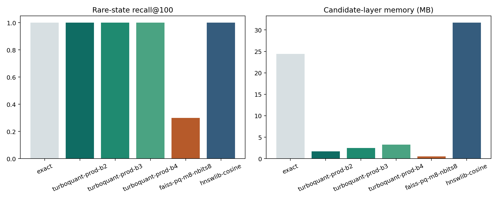

Rare-state retrieval
====================

Background
----------

Rare or coherent disease states are the clearest current success case for TurboCell Atlas. They provide a compact neighborhood in embedding space, which makes candidate compression easier to trust.

Objective
---------

The goal of this scenario is to start from an ``IPF myofibroblast centroid`` and ask whether TurboQuant can preserve the biologically relevant nearest-neighbor structure while reducing candidate-layer memory.

Input
-----

The executed example uses the public SCimilarity tutorial dataset together with the real-data case-study pipeline included in the repository.

Process
-------

The workflow is:

#. define the centroid query
#. generate compressed candidates
#. rerank those candidates in the original embedding space
#. compare the final top-k result with exact retrieval

Result
------

The rare-state article is valuable because it shows the strongest positive result in the current project state. In this scenario, TurboQuant preserved the exact top-100 neighborhood while using substantially less memory in the candidate layer.

What this teaches
-----------------

This tutorial shows that TurboCell Atlas is already useful for compact disease-state retrieval and for method comparison discussions where both memory and ranking agreement matter.

Related artifacts
-----------------

* ``artifacts/scenario_articles/rare_state_summary.csv``
* :doc:`../guides/real-data-case-study`
