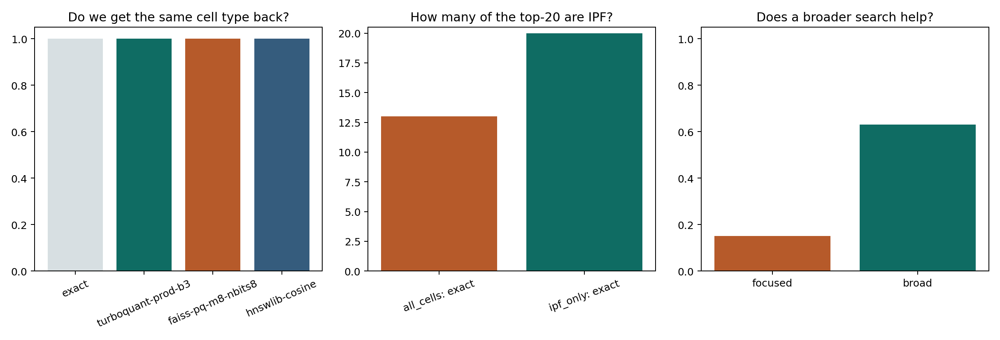

# Wet Lab Guide

This page is written for readers who want to use TurboCell Atlas without first reading the algorithm details. It uses the executed SCimilarity tutorial-data analyses and explains what to put in, what comes back, and how to read the outputs.

## In one sentence

TurboCell Atlas helps you ask a simple question:

> If I describe one cell state that I care about, what similar cells can I find in a large atlas?

## What you put in

You usually need three things:

1. a reference atlas represented as cell embeddings plus metadata
2. a query state, such as a centroid of annotated cells
3. optional filters, such as `IPF` only or one tissue only

The easiest concrete starting files are:

- `configs/wetlab_metadata_template.csv`
- `notebooks/wet_lab_walkthrough.ipynb`

## What you get back

The main outputs are:

- a ranked list of cells that look most similar to the query
- summary tables showing whether the returned cells match the disease or cell type you expected
- figures that compare search methods or search settings

## Three easy use cases from real analyses

### 1. Rare-state lookup

Question:

- If I search with an `IPF myofibroblast` state, do I get back the same kind of cells?

Observed result:

- yes
- TurboQuant and exact search returned the same top-100 neighborhood
- the top 10 hits were all `IPF myofibroblast cell`

See:

- `artifacts/wetlab_examples/myofibroblast_top10.csv`
- [Rare-State Retrieval](tutorial-rare-state.md)

### 2. Cohort triage

Question:

- If I only care about `IPF`, should I search in the whole atlas or inside `IPF` cells only?

Observed result:

- the answer changed a lot
- without filtering, the top-20 still contained `healthy` and `COPD` cells
- with `IPF` filtering, the top-20 became entirely `IPF`

See:

- `artifacts/wetlab_examples/cohort_triage_readout.csv`
- [Cohort Triage with Metadata Filters](tutorial-cohort-triage.md)

### 3. Single-cell lookup

Question:

- I only have one interesting cell. Can I still start searching?

Observed result:

- yes
- in the executed example, one `IPF myofibroblast cell` already recovered a coherent local neighborhood

See:

- `artifacts/scenario_articles/single_cell_query_summary.csv`
- [Single-Cell Query](tutorial-single-cell.md)

### 4. Broad-state search

Question:

- What if my query is broad and the first result looks weak?

Observed result:

- broad planning helped a lot
- recall improved from about `0.15` to about `0.63` for the `IPF alveolar macrophage` query

See:

- `artifacts/wetlab_examples/broad_state_readout.csv`
- [Broad-State Tuning](tutorial-broad-state.md)

## How to read the outputs

The executed helper table is written to `artifacts/wetlab_examples/how_to_read_outputs.csv`.

### Top hit table

Meaning:

- which cells came back first

How to use it:

- check whether the returned cell type matches what you expected
- check whether the disease labels make biological sense

### Top-20 IPF fraction

Meaning:

- how disease-specific the result looks

How to use it:

- if this value is low, your query may be too broad or your cohort may be too mixed

### Recall@100 vs exact

Meaning:

- how similar the approximate result is to exact search

How to use it:

- higher is better
- if recall is low, treat the approximate result as exploratory rather than definitive

### Candidate memory

Meaning:

- how much memory the compressed search layer uses

How to use it:

- lower memory is useful only if the biological answer still makes sense

## Where to start

If you want the easiest path:

1. read this page
2. copy the metadata structure in `configs/wetlab_metadata_template.csv`
3. open `notebooks/wet_lab_walkthrough.ipynb`
4. open [Single-Cell Query](tutorial-single-cell.md) if you want to start from one cell
5. open [Rare-State Retrieval](tutorial-rare-state.md) if your target is a compact disease state
6. open [Cohort Triage with Metadata Filters](tutorial-cohort-triage.md) if cohort restriction matters
7. open [Broad-State Tuning](tutorial-broad-state.md) if your first result looks weak

## Important caution

TurboCell Atlas is best treated as a retrieval aid, not an automatic biological truth machine. The method helps prioritize similar cells to inspect. Final interpretation still depends on the metadata, the disease context, and whether the returned cells make sense to a domain expert.
